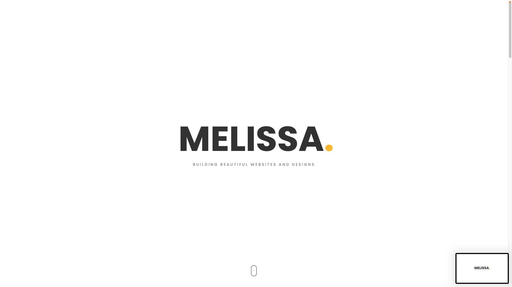

# Melissa's Portfolio

**Welcome** to my portfolio! I'm Melissa, a Software Engineer passionate about creating functional and aesthetic Web Applications. Here, you'll find a showcase of my projects, skills, and contributions to web development.



### Live Demo: [View Demo](https://melissarose.info)

## Table of Contents
[Projects](#projects)
[Technologies](#technologies)
[Setup and Installation](#setup-and-installation)
[Lessons Learned](#lessons-learned)
[Acknowledgements](#acknowledgements)
[Contact](#contact)

## Projects

Here are some of my featured Projects:

### 1. Tupac Tribute Page
**Description:** A tribute page to Tupac Shakur. Sharing life events and a picture gallery.
**Tech Stack:** HTML, CSS
**Live Demo:** [View Demo]()- <!-- ? INSERT LINK HERE -->
**Repository:** [View Repository]() <!-- ? insert link here -->

### 2. Contact Form
**Description:** A survey contact form for feedback on FreeCodeCamp.
**Tech Stack:** HTML, CSS
**Live Demo:** [View Demo]()- <!-- ? INSERT LINK HERE -->
**Repository:** [View Repository]() <!-- ? insert link here -->

### 3. JS Technical Document
**Description:** A technical document teaching the basics of JavaScript. With an automatic dectector of the users color-scheme preference (Light / Darkmode).
**Tech Stack:** HTML, CSS
**Live Demo:** [View Demo]()- <!-- ? INSERT LINK HERE -->
**Repository:** [View Repository]() <!-- ? insert link here -->

And more smaller projects within my portfolio 

## Technologies

I have experience with a variety of technologies, including:
- **Frontend:** HTML5, CSS3, JavaScript(ES6+), Bootstrap
- **Version Control:** Git, Github
- **Development Tools:** Homebrew, iTerm 2
- **Other Tools:** Canva

## How to Clone my Repository

Feel free to clone any project from the repository to explore the code locally.

1. **Clone the repo:**
```bash
git clone https://github.com/yourusername/your-repo-name.git 
```

2. **Navigate into the project directory:**
```bash
cd your-repo-name
```

3. **Install dependencies:**
```bash
npm install
```

4. **Start the development server:**
```bash
npm start
```
