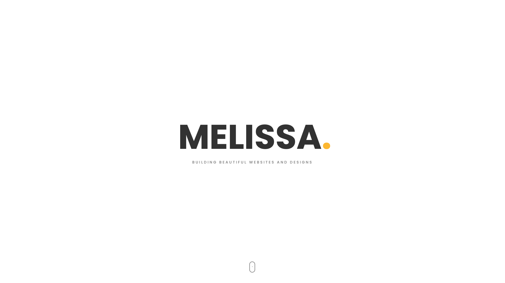

# Melissa's Portfolio

**Welcome** to my portfolio! I'm Melissa, a Software Engineer passionate about creating functional and aesthetic Web Applications. Here, you'll find a showcase of my projects, skills, and contributions to web development.



### Live Demo: [View Demo](https://melissarose.info)

## Table of Contents
- [Projects](#projects)
- [Technologies](#technologies)
- [Lessons Learned](#lessons-learned)
- [Contact](#contact)
- [How to Clone my Repository](#how-to-clone-my-repository)

## Projects

Here are some of my featured Projects:

### 1. Tupac Tribute Page
**Description:** A tribute page to Tupac Shakur. Sharing life events and a picture gallery.<br>
**Tech Stack:** HTML, CSS<br>
**Live Demo:** [View Demo](https://tupacshakur-tribute.netlify.app/)<br>
**Repository:** [View Repository](https://github.com/QueenMissRose/tribute-page)<br>

### 2. Contact Form
**Description:** A survey contact form for feedback on FreeCodeCamp.<br>
**Tech Stack:** HTML, CSS<br>
**Live Demo:** [View Demo](https://freecodecampformsurvey.netlify.app/)<br>
**Repository:** [View Repository](https://github.com/QueenMissRose/Survey-Form)<br>

### 3. JS Technical Document
**Description:** A technical document teaching the basics of JavaScript. With an automatic dectector of the users color-scheme preference (Light / Darkmode).<br>
**Tech Stack:** HTML, CSS<br>
**Live Demo:** [View Demo](https://jstechnicaldocument.netlify.app/)<br>
**Repository:** [View Repository](https://github.com/QueenMissRose/Technical-Document)<br>

And more smaller projects within my portfolio 

## Technologies

I have experience with a variety of technologies, including:
- **Frontend:** HTML5, CSS3, JavaScript(ES6+), Bootstrap
- **Version Control:** Git, Github
- **Development Tools:** Homebrew, iTerm 2
- **Other Tools:** Canva

## Lessons Learned

Throughout the process of creating my portfolio, I gained valuable insights and skills. I learned how to read and understand other people's code, as well as how to integrate my own code into existing templates. This was my first experience using a template, and I initially expected it to be straightforward. However, I found that adapting it to fit my own vision was quite challenging at times.

Additionally, it was my first time working with Bootstrap and JavaScript, which were already incorporated into the template. This experience pushed me to deepen my understanding of both technologies, as I navigated the learning curve and explored how they could enhance my project.

## Contact

I'd love to hear from you! Whether you want to commision me for a site of your own, colab on something together, or chat about anything tech!

- **Email:** [contact@melissa.info](contact@melissa.info)
- **Linkedin:** [Melissa Rose](https://linkedin.com/in/melissaphyn)
- **Twitter:** [Missrose_dev](https://twitter.com/missrose_dev) 

twitter is where i'm most active <3

## How to Clone my Repository

Feel free to clone any project from the repository to explore the code locally.

1. **Clone the repo:**
```bash
git clone https://github.com/yourusername/your-repo-name.git 
```

2. **Navigate into the project directory:**
```bash
cd your-repo-name
```

3. **Install dependencies:**
```bash
npm install
```

4. **Start the development server:**
```bash
npm start
```